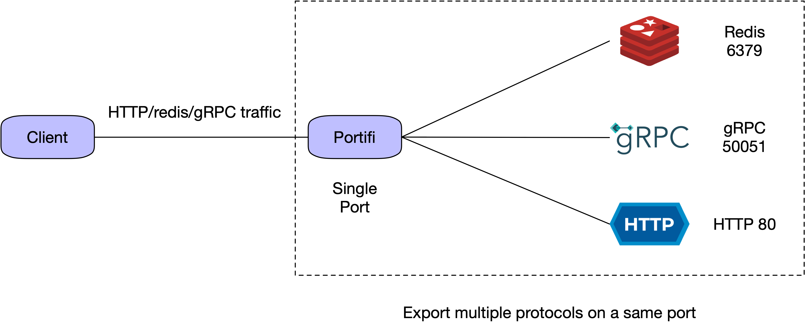

# portifi

[](https://github.com/guohao/portifi/actions/workflows/gradle.yml)
[](https://opensource.org/licenses/Apache-2.0)

A powerful reverse proxy redirecting multiple protocols on a same port.

## Features

- Redirect network traffic from **ONE** port with multiple protocols:HTTP1.1/ HTTP/2(gRPC)/ redis
- Serve as SDK or standalone gateway



## Usage Scenarios

- **Protocol Upgrade:** Adopt a newer/better protocol to strengthen your app without changing origin behaviors. HTTP/1.1
  -> gRPC etc
- **Unary Gateway:** Act as an all-in-one gateway to hide the complex topology of internal system
- **FaaS Negotiator Component :** Talk to different 3rd-party systems with **ZERO** configuration
- **Faraway from Legacy Systems**: No need to modify DNS or protocol's config of those corrupt apps

## Quick Start

You can take a look at [examples](examples) and run a `portifi` server quickly.

Or read this quick start.

### Prerequisite

- JDK: 8 or higher

Add `Portifi` to your `build.gradle.kts`.

```kotlin
dependencies {
    implementation("io.github.guohao:portifi:0.0.1")
}
```

Start `Portifi` server to proxy HTTP(8080) on port `9999`.

```kotlin
fun main() {
    ProxySpecBuilder(8080)
        .protocol(Protocol.HTTP1_1)
        .build()
        .asServer()
        .start(9999)
}
```

Start a backend HTTP server at 8080 (python3 as a sample).

```shell
$ python3 -m http.server 8080
```

Run a test

```shell
$ curl localhost:9999
```
